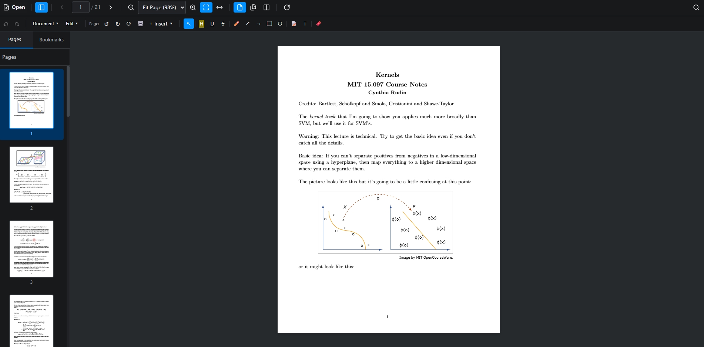
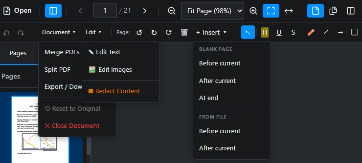

[English](README.md)

告别昂贵的月度订阅和侵入性的云同步。**PDF-Editor** 是 Adobe Acrobat 和 Foxit 的免费、私密、开源替代品。专为需要专业级功能而不想忍受企业臃肿软件的用户设计，它让您可以直接在设备上**查看**、**批注**、**合并**和**编辑** PDF 文档。零隐藏费用，100% 本地处理，您的敏感数据永远不会离开您的设备——强大的文档管理不必以牺牲隐私或金钱为代价。

<div align="center">
  
  
</div>

## 功能特性

- **📄 PDF 查看与导航**：通过缩略图、书签和直观的页面控件流畅浏览文档。
- **✏️ 丰富的批注工具**：高亮、下划线、手绘、添加形状和便签到您的 PDF。
- **🔗 合并与拆分**：轻松将多个 PDF 合并为一个或提取特定页面。
- **🖼️ 图片插入**：在 PDF 文档的任意位置添加和定位图片。
- **🔒 100% 隐私保护**：所有处理都在本地设备上完成——您的文件永远不会离开您的电脑。
- **💰 免费开源**：无订阅、无隐藏费用、无云依赖——永久免费。

## 快速开始

### 环境要求

- [Node.js](https://nodejs.org/)（v18 或更高版本）
- npm（随 Node.js 一起安装）

### 安装

```bash
# 克隆仓库
git clone https://github.com/JhuoW/PDF-Editor.git
cd PDF-Editor

# 安装依赖
npm install
```

### 运行应用

```bash
# 启动开发服务器
npm run dev
```

应用将在浏览器中打开，地址为 `http://localhost:5173`。

### 基本使用

1. **打开 PDF**：点击"打开文件"或将 PDF 文件拖放到查看器中
2. **导航**：使用缩略图侧边栏或页面控件在页面之间切换
3. **缩放**：使用缩放控件或 Ctrl + 鼠标滚轮调整视图
4. **批注**：从工具栏选择批注工具进行高亮、绘图或添加注释
5. **保存**：点击"保存"下载编辑后的 PDF

## 参与贡献

我们欢迎社区的贡献！无论是修复 bug、添加新功能、改进文档还是提出建议，您的帮助都能让 PDF-Editor 变得更好。

如果您发现 bug 或有功能需求，欢迎提交 [issue](https://github.com/JhuoW/PDF-Editor/issues)。我们感谢每一份贡献，无论大小！
